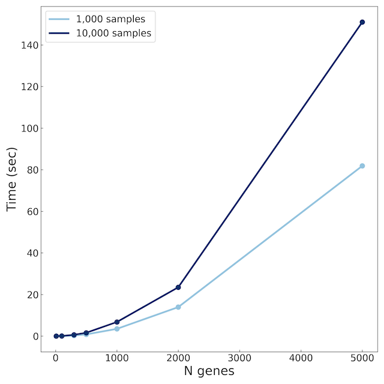

<p align="center">
  
  <br>
      Fast pairwise mutual information for Python and C++
</p>


Intro
=====

A fast pairwise mutual information calculation for Python and C++, optimised for small repeated integer counts such as those seen in single-cell RNA sequencing data. This uses the copula method to combine normal or negative binomial marginal distributions and a kd-tree for joint density estimation. In this way, sparse zero-inflated data are naturally incorporated, and as an added benefit, the $\chi^2$ test statistic versus zero mutual information is also calculated on the fly.

The mutual information between two discrete variables $X$ and $Y$ is
```math
I(X, Y) = \sum_x\sum_y p_{XY}(x, y) \log \left( \frac{p_{XY}(x, y)}{p_X(x)p_Y(y)} \right).
```
With the assumption that we know the marginal distributions of $X$ and $Y$, (normal, negative binomial, etc) we transform them using the CDF such that they are uniform. Therefore, $p_X(x)$ and $p_Y(y)$ are constant, and we describe $p_{XY}(x, y)$ using a kd-tree. As a bonus, this means that the 'zero mutual information' null hypothesis for the $\chi^2$ test is now just a uniform distribution in $p_{XY}(x, y)$, in the same kd-tree leaves. Along with a few more optimisations due to the small integer counts, this approach results in a fast and robust estimate of the pairwise mutual information that comes with a signififance measure for free.

Usage
=====

In Python, pairwise mutual information calculations are provided for both normal (`mi_normal`) and negative binomial (`mi_negative_binomial`) marginal distributions. These functions are overloaded to accept either scalar or vector (e.g., `np.array`) of floating point or integer valued observations. Several optimisations are provided for integer valued data.

These functions have to be passed the parameters of the corresponding marginal distributions. For example, for the normal distribution:

```python
from fast_mutual_information import mi_normal

# mean and standard-deviation for the two distributions
mean1, std_dev1 = 0.0, 1.0
mean2, std_dev2 = 0.0, 1.0

# data: an (Nsamples, 2) array
mi, chi2 = mi_normal(mean1, std_dev1, mean2, std_dev2, data)
```

and for the negative binomial distribution (in the `nb2` parameterisation):

```python

from fast_mutual_information import mi_negative_binomial

# means and concentrations for negative binomial marginals
mean1, conc1 = 10, 10
mean2, conc2 = 10, 10

data = np.random.normal(0, 1, (1000, 2)).astype(np.int32)

# data: an integer data array of shape (Nsamples, Nfeatures)
mi_matrix, chi2_matrix = mi_negative_binomial(data, means, concentrations)

```

The vector functions take an `(N_samples, N_features)` array of data, and return an `(N_features, N_features)` matrix of mutual information values, of which only the upper triangular part is filled.

These are parallelised using OpenMP, so be sure to set `OMP_NUM_THREADS` to a reasonable value:

```bash
export OMP_NUM_THREADS=4
```

Performance
====



Run time comparison on an M3 Pro, with `OMP_NUM_THREADS=8`.

Installation
=====

For Python, install from PyPi using pip:

```bash
pip install fast_mutual_information
```

or, using the [latest wheel](https://github.com/dpohanlon/fast_mi/releases) for your platform from GitHub:

```bash
pip install fast_mutual_information-0.1.0-cp310-cp310-macosx_11_0_arm64.whl
```

or, to install from source, see below.

Building
========

This is the best way to ensure that the package uses as many features of your CPU as possible, as the pre-built libraries are built assuming generic CPU architectures.

When building from source, this package requires CMake, Boost, Eigen, OpenMP, and PyBind11. PyBind11 is included with the package, however the rest are best installed using the package manager for your system. On Mac these can be installed using `brew`:

```bash
brew install cmake
brew install eigen
brew install libomp
brew install boost
```

and OpenMP requires the path to be set:

``` bash
export OpenMP_ROOT=$(brew --prefix)/opt/libomp
```

On Ubuntu, these can be installed using `apt-get`:

```bash
sudo apt-get install cmake
sudo apt-get install python3-dev
sudo apt-get install libboost-all-dev
sudo apt-get install libeigen3-dev

```

This package also requires the [fast_negative_binomial](https://github.com/dpohanlon/fast_mi) package, which by default is included as a submodule.

To checkout the repository, as well as the PyBind11 and FastNB submodule:

``` bash

git clone --recurse-submodules git@github.com:dpohanlon/fast-mi.git
cd fast_mi
```

C++
---

To build the C++ library, you can build with CMake:

```bash
mkdir build
cd build
cmake ../
make -j4
```

and to build with the optional benchmarks (requires Google Benchmarks), configure cmake with the argument `-DENABLE_BENCHMARK=true`:

```bash
cmake ../ -DENABLE_BENCHMARK=true
```

Python
-----

With the repository checked out, build using pip:

```bash
pip install .
```

Contributing
-------

If you've made modifications, reformat with `clang-format`:

```bash
clang-format -i -style=file fast_mutual_information/*pp
```

Optimisations
=============

Several optimisations have been implemented to accelerate mutual information computations, especially when working with repeated integer values. The package constructs a kd-tree from the transformed data to reduce the computational complexity of pairwise distance evaluations. This significantly speeds up the mutual information calculation.

Copula Transformation
---------------------

Mutual information is computed in the transformed space via a copula. This decouples the marginals from the dependency structure, enabling flexible specification of marginal distributions (e.g., normal, uniform, negative binomial). The copula functions are configurable, allowing for on-the-fly calculations.

Optimisations for Integer Inputs
-------------------------------

The kd-tree in the integer case is calculated on the raw input data, rather than the uniform distribution required for the copula, in order to exploit a 'run length' representation of the data. This keeps track of repeated values, so that the computation needs only happen once for each unique value. When the PDF of the copula is computed for the MI calculation, the CDF transformation is performed on the fly.
